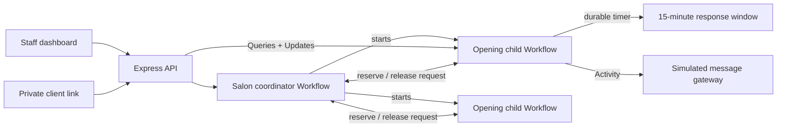

# Juniper Salon waitlist

A Temporal-backed prototype for filling last-minute salon cancellations without making staff manage a spreadsheet, message clients one by one, or watch response timers.

The prototype answers one question: **can durable, sequential outreach fill openings reliably while ensuring that only one client can reserve an appointment?**

## What the prototype demonstrates

- Staff add a same-day opening for a service, stylist, date, and time.
- Eligible waitlist requests are matched by service, availability, and stylist requirements.
- Clients are contacted one at a time in earliest-joined order.
- Every same-day client gets a 15-minute response window. Demo mode compresses this to 15 seconds and labels that behavior clearly.
- Declines, timeouts, and failed deliveries move to the next eligible client automatically.
- A client can hold only one active offer across concurrent openings.
- The first valid acceptance reserves the opening; competing and late responses cannot change the result.
- Staff see the current offer, countdown, candidate history, alerts, and recent outcomes.
- Accepted openings remain **Reserved** until staff marks the Square calendar updated, when they become **Confirmed**.
- Staff can stop or cancel outreach, cancel an accepted offer, and reopen outreach with the next uncontacted client.
- The client experience is a private, mobile-friendly accept/decline page.

The sample names and phone numbers are fictional. SMS delivery, Google Sheets synchronization, Square integration, and production authentication are deliberately out of scope.

## Run locally

Requirements: Node.js 20 or newer and Docker Desktop.

```bash
npm install && npm run dev
```

Then open:

- Staff experience: <http://localhost:3000>
- Temporal Web UI: <http://localhost:8233>

Presentation: [4-slide PDF](output/pdf/juniper-salon-prototype.pdf) or [editable PowerPoint](output/pptx/juniper-salon-prototype.pptx)

`npm run dev` starts the local Temporal server, Worker, and API. Temporal state is stored in the Docker volume declared in `compose.yml`.

Other commands:

```bash
npm test
npm run typecheck
npm run stop
```

## Suggested walkthrough

1. Open the staff dashboard and select **Add an opening**.
2. Choose **Haircut & Finish**, **Lena**, today, and an afternoon time.
3. Open the generated client link from the active-opening card.
4. Accept on the client page and observe the staff card become **Reserved**.
5. Try accepting the same link again; it stays safely reserved for the original winner.
6. Select **Mark Square updated** to make the appointment **Confirmed**.
7. Under **Demo settings**, mark a waitlist client’s next message as failed and create a matching opening to see immediate automatic progression and a staff alert.
8. Create two matching openings close together to see the coordinator prevent competing offers to the same waitlist request.

## Temporal design



### Salon coordinator Workflow

`salonCoordinatorWorkflow` is the durable source of truth for the editable waitlist, opening summaries, alerts, and request reservations. Reservation requests are serialized by this Workflow, making it impossible for two opening Workflows to offer the same waitlist request at once.

### Opening child Workflow

Each cancellation starts an `openingWorkflow`. It owns the ordered candidate history and transitions through matching, offering, reserved, confirmed, stopped, canceled, or unfilled states. Temporal timers replace staff-managed clocks. Updates provide synchronous accept/decline and staff-action results, while Queries keep both browser experiences current.

### Notification Activity

`sendNotification` is a local Activity that simulates an SMS boundary. A demo control can make the next delivery fail. The Workflow records the failure, releases the client reservation, alerts staff, and proceeds immediately without retrying—as Lena requested. A real provider can replace this Activity without changing the durable process.

### Why Temporal matters here

- **Durable timers:** a response window survives Worker or API restarts.
- **Serialized message handling:** concurrent accept attempts produce one winner.
- **Cross-opening coordination:** one Workflow atomically reserves or releases waitlist requests.
- **Visible history:** candidate offers, responses, failures, and staff interventions appear in Workflow history.
- **Recovery:** process state lives in Temporal rather than a browser timer or in-memory API map.

## Tests

The Workflow suite uses Temporal’s time-skipping test environment and covers:

- concurrent accept attempts with exactly one winner;
- failed delivery followed by automatic progression;
- unanswered offers expiring via a durable timer;
- concurrent openings competing for one waitlist request;
- staff stop, reopen, next-client progression, and cancellation.

The custom test launcher compiles TypeScript before invoking Node’s test runner. This avoids a `tsx`/Node 24 issue on Windows while preserving the same Temporal tests.

## Repository map

- `src/workflows.ts` — coordinator and opening Workflows, Queries, Signals, and Updates
- `src/activities.ts` — simulated notification Activity
- `src/api.ts` — API, fictional seed data, and static-site host
- `src/types.ts` — shared domain model
- `public/` — responsive staff and client experiences
- `tests/workflow.test.ts` — Temporal behavior tests
- `evidence/` — representative Temporal Web UI evidence

## Production follow-ups

This is an assessment prototype, not a production booking system. A production version would add staff authentication and authorization, signed expiring client links, an SMS provider with verified consent and opt-out handling, Square synchronization with reconciliation, structured persistence/reporting beyond current-week Workflow state, timezone and holiday rules, accessibility testing, and operational monitoring.
